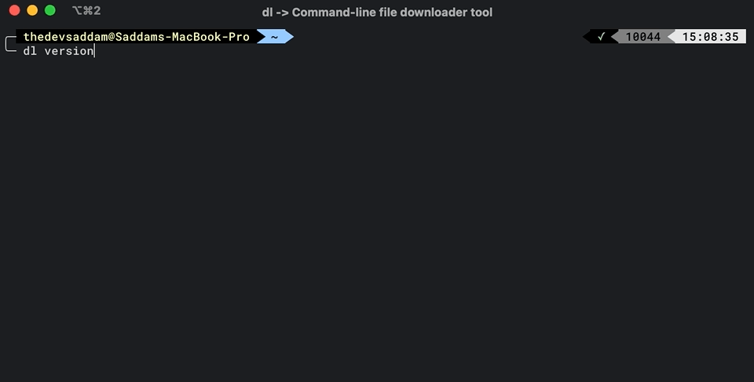

DL
---
Command-line file downloader tool

### Usage

```sh
$ dl -u https://www.url.com/foo.ext
```




#### Installation on Mac/Linux
```bash
curl https://raw.githubusercontent.com/thedevsaddam/dl/main/install.sh -o install.sh \
&& chmod +x install.sh \
&& ./install.sh \
&& rm install.sh
```

#### Uninstallation
```bash
curl https://raw.githubusercontent.com/thedevsaddam/dl/main/uninstall.sh -o uninstall.sh \
&& chmod +x uninstall.sh \
&& ./uninstall.sh \
&& rm uninstall.sh
```

#### Windows
**For windows download the binary and set environment variable so that you can access the binary from terminal**

**[Download Binary](https://github.com/thedevsaddam/dl/releases)**

### Download options

```sh
$ dl -u https://www.url.com/foo.ext
# or with concurrency
$ dl -u https://www.url.com/foo.ext -c 10
# with debug mode enabled (if you are curious!)
$ dl -u https://www.url.com/foo.ext -c 10 -d
# with custom output file name
$ dl -u https://www.url.com/foo.ext -c 10 -d -n bar.ext
```
### Configurations

**Setup destination directory**

```sh
# set current directory path as destination directory
$ dl config -p .
# or set other directory
$ dl config -p $HOME/Downloads
```
Note: If you have `destination` directory set then all files automatically will be saved there. If you want to override on the fly then use `-p .` flag to download in the current directory.
By default the `destination` directory value is empty that means the file will be downloaded in the current directory.

**Setup sub-directory/extensions**

Note: If `destination` directory is not set then the sub-directory/extensions will NOT WORK

```sh
# set sub-directory based on extensions
# this will create a "binary" diectory inside root directory. 
# all downloads with .exe, .dmg extensions will be stored there
$ dl config -s "binary:.exe,.dmg"
```

**Setup concurrency**

```sh
# default concurrency is 5, you can set default value by passing -c flag in config
$ dl config -c 10
```

### Default configurations

<details><summary>config.json</summary>
<pre>
{
	"directory":"",
	"concurrency":5,
	"sub_dir_map":{
		"audio":[
			".aif",
			".cda",
			".mid",
			".midi",
			".mp3",
			".mpa",
			".ogg",
			".wav",
			".wma",
			".wpl"
		],
		"document":[
			".xls",
			".xlsm",
			".xlsx",
			".ods",
			".doc",
			".odt",
			".pdf",
			".rtf",
			".tex",
			".txt",
			".wpd",
			".md"
		],
		"image":[
			".ai",
			".bmp",
			".ico",
			".jpeg",
			".jpg",
			".png",
			".ps",
			".psd",
			".svg",
			".tif",
			".tiff"
		],
		"video":[
			".3g2",
			".3gp",
			".avi",
			".flv",
			".h264",
			".m4v",
			".mkv",
			".mov",
			".mp4",
			".mpg",
			".mpeg",
			".rm",
			".swf",
			".vob",
			".wmv"
		]
	}
}
</pre>
</details>


### Contribution
Your suggestions will be more than appreciated.
[Read the contribution guide here](CONTRIBUTING.md)

### See all [contributors](https://github.com/thedevsaddam/dl/graphs/contributors)

### **License**
The **dl** is an open-source software licensed under the [MIT License](LICENSE.md).
